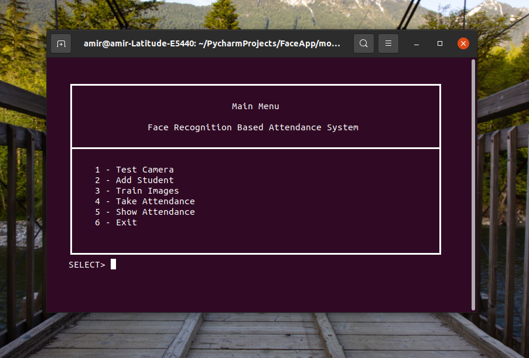

# Face Recognition Attandance System


>Recognize The faces And Take Automatic Attandance.

---

### Table of Contents
You're sections headers will be used to reference location of destination.

- [Description](#description)
- [How To Use](#how-to-use)
- [Proposed Technique](#proposed-technique)
- [Error Analysis](#error-analysis)
- [License](#license)
- [Author Info](#author-info)


## Description
Attendance plays a pivotal role in determining academic performance of children and youth in schools and colleges. the manual process of taking attendance by calling each student’s name is inefficient due to the following reasons:
* It takes away a lot of lecture hours
* Prone to proxies or impersonations

therefore, we seek to provide an automated and reliable attendance system using the face recognition technology.

#### Objective
* To design a real-time face recognition system that identifies people within the premises of an organization i.e. universites, colleges, Business Campanies etc. The system is meant to take live video footage as an input through the different CCTV cameras installed at various vital locations.
* To design a web portal for the educational institutes where the insitutes can register themself and make use of the automated attendance system.

## How To Use

#### Installation
Download or Clone the project on your local machine.
```
$ git clone https://github.com/hisham-maged10/path-finder.git
```
After downloading or cloning, create an python enviroment for the project. To create virtual enviorment open the terminal or command line, `cd` into the project directory.
```
$ cd /home/username/PycharmProjects/FaceApp/model
```
Now create a python virtual environment and activate it.
```
$ python -m venv env
$ source env/bin/activate
```
*Notice:* If your pc don't have virtual enviroment or pip install the follow this link. [How to create Virtual Enviroment](https://packaging.python.org/guides/installing-using-pip-and-virtual-environments/ "How to create Virtual Enviroment")

After creating the enviroment for the project now it is time to install the necessary python dependencies.
#### Dependencies
- Dlib
- Tensorflow
- Keras
- OpenCv
- sklearn
- numpy, pandas and matplotlib etc

to install the dependencies type the below after activating the virtual environment.
```
$ pip install -r requirements.txt
```

#### Usage
- Add students with required details i.e. name, label, images etc.
- Preprocess students data
- Train classifier using the preprocessed data
- Take Attendance using created classifiers

A minimal CLI tool has been added to make use of all these features at one place.
```
$ python runx.py
```
Here is a demo to run the CLI tool.



you can also change any default settings by editing the `config.py` file.

each feacture of the system listed above can also be done manually by mere running the the python files dedicated to those features like to process data run `preprocess.py` with appropriate CLI args. i.e.
```
$ python preprocess.py -i path/to/the/data
```
also the arguments are optional if not provide the default values will be used from `config.py`. same case with the other features of system.

In case of creating an student or entity the system follows some conventions like for student we have to create a directory named as *`student_<name of student>_<label>`* and the student_ is a prefix convention which has to be follwed. this can be changed inside `config.py`.

by default the system will create a general classifier but if you want to group students according to subjects or classes we can create a directory named as `subject_<name of subject>`. in both of the cases **student_** and **subject_** are conventions which has to be follwed. they can be changed inside `config.py`.


## Proposed Technique
The algorithm has Four phases:
1. Data Augmentation
2. Preprocessing
3. Model training
4. Web application development

for detailed information with examples please refer to the [FaceApp.ipynb](https://github.com/MuhammadAmir5670/face-attendance-app/blob/master/FaceApp.ipynb) file.

## Error Analysis
The possible reasons for the errors could be:

1. Change in the person’s face over time - considerable facial change from the photo used in training.
2. Two or more similar looking people - If there are multiple people with similar faces, then the model may wrongly classify a person as someone else.
3. Lack of training data - Deep learning networks are known to increase their accuracy in increasing the data. Since we have only one image per person, therefore there is scope for the model to be trained more efficiently.

## License
<a href="https://github.com/MuhammadAmir5670/face-attendance-app/blob/master/LICENSE"></a>

## Author Info
- Gmail [muhammadamir5670@gmail.com]()
<p align="left">
<a href = "https://www.linkedin.com/in/muhammad-amir-9826b71b5/"></a>
<a href = "https://twitter.com/Daniyal60990408/"></a>
<a href="https://www.facebook.com/daniyal.abbasi.1610/">

</a>
<a href = "https://www.instagram.com/the_infamous_abbasi/"></a>
</p>